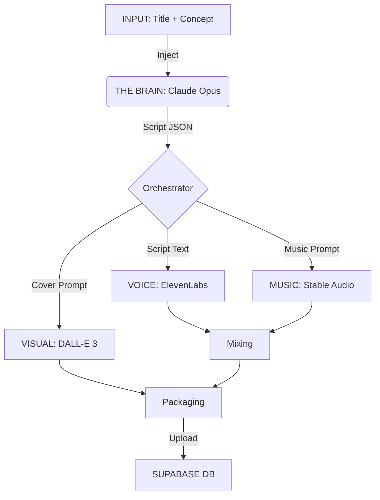

# 06. THE AUDIO FACTORY WORKFLOW 🏭
*How we turn a single sentence into a premium audio experience.*

---

## 🏗️ THE ARCHITECTURE
The Factory treats AI not as a "Chatbot", but as a **Creative Director**.
We input a seed, and the Director (Claude Opus) orchestrates an entire production team (ElevenLabs, Stable Audio, DALL-E) to execute the vision.

### Visual Diagram


---

## 🔎 STEP-BY-STEP ANALYSIS (Anatomy of "The Night Train")

### 1. THE SEED (What Yo Input)
We started with **only** this minimal brief:
```json
{
  "title": "The Night Train",
  "description": "A luxury train ride through the snowy Alps at night...",
  "category": "sleep"
}
```

### 2. THE BRAIN (What Claude Does)
We don't ask Claude to "write a story". We inject a **System Persona** (The "Sleep Storyteller") with strict rules:
*   **No "Imagine if"**: Start directly with sensation.
*   **Hypnotic Pacing**: Use `[pause]` markers for breath.
*   **Sensory Rules**: Must use Temperature, Texture, and Sound descriptions.

**The Output (JSON)**:
Claude returns a structured JSON object containing *instructions* for other AIs.

#### A. The Narrative Core
> *"The cabin window fogs with your breath... Your compartment glows amber... The train's rhythm rocks you gently..."*

#### B. The Music Directive (Prompt Engineering)
Claude ignores the story text here and writes a technical spec for a Sound Engineer:
> *"Ambient sleep music with deep warm pad drones, **subtle metallic percussion mimicking train wheel rhythms**, sparse piano notes like distant bells..."*
*   *Why this matters*: It ensures the music matches the story's *specific* texture (Train wheels), not just generic "Sad Piano".

#### C. The Visual Directive
Claude hallucinates the perfect cover art:
> *"Interior view of a luxury vintage train compartment at night, warm amber lamplight... frosted window showing blurred snowy mountain landscape..."*
*   *Why this matters*: It ensures the UI looks exactly like the audio feels.

### 3. THE EXECUTION (The Workers)

#### 🎙️ Station 1: Voice (ElevenLabs)
*   **Input**: The Script text.
*   **Processing**: 
    *   Removes `[pause]` markers and replaces them with silent audio gaps.
    *   Applies the "Soft Male" voice model (Liam).
*   **Output**: `voice.mp3` (Narrator only).

#### 🎵 Station 2: Music (Stable Audio)
*   **Input**: The "Music Prompt" generated by Claude.
*   **Processing**:
    *   Stable Audio 2.0 generates a 3-minute stereo track.
    *   It interprets "metallic percussion" and "drones" to create a bespoke backing track.
*   **Output**: `music.mp3` (Instrumental only).

#### 🖼️ Station 3: Art (DALL-E 3)
*   **Input**: The "Cover Prompt" generated by Claude.
*   **Processing**:
    *   Generates 2 formats: Landscape (Web Hero) and Portrait (Mobile Card).
*   **Output**: `cover_landscape.png`, `cover_portrait.png`.


---

## 4. CRITICAL AUDIT & UPGRADE PLAN 🛠️
*Strategic analysis of the current pipeline (Jan 2026).*

### ✅ What We Nailed (The Strengths)
1.  **AI as Creative Director**: Claude orchestrates workers, ensuring high coherence.
2.  **Output as DSL**: The JSON is a "production contract", not just raw text.
3.  **Textured Music Prompts**: "Metallic percussion" context is superior to generic "Sad ambient".

### ⚠️ The Risks (The Weaknesses)
1.  **Stable Audio Unpredictability**: Transients/loops are not guaranteed to be safe for sleep.
2.  **Flat Audio Mixing**: Currently mixes are volume-based only, lacking narrative volume curves.
3.  **Cost Scaling**: Generating bespoke music for *every* track is unsustainable for a large catalog.

## 5. FUTURE STANDARD: UNIFIED PIPELINE (V3 PLANNED) 🎯
*The target architecture to be implemented next.*

We will move to a **Single Medical-Grade Standard** for all 10 Production Formats.

### A. The Production Strategy (10 Formats)
We continue to produce distinct assets for all vertical needs:
*   `motivation` (Pep talks) -> served via **Energized** Mood.
*   `kids` (Bedtime) -> served via **Dreamy** Mood.
*   `binaural` (Focus Freqs) -> served via **Focus** Mood.

### B. The Technical execution
1.  **Eliminate Stable Audio**: Reduce op-risk and cost to zero.
2.  **Universal Loops**: All 10 formats will use curated, seamless loops from `assets/loops/`.
3.  **Strict "Loop ID" Input**: The Factory will require a specific loop ID (e.g. `sck_rain_01`) to run.

**Why?**
*   **Creative Freedom**: We can make specific content (e.g. for Kids) without cluttering the main UI.
*   **Simplicity**: The User only sees "How do you want to feel?", while we manage the complexity of *how* to get them there.


---

## 🎛️ THE FINAL MIX
The Factory takes these raw assets and (in the full `mix` command) combines them:
1.  **Voice Track**: Center channel.
2.  **Music Track**: Background (-15dB volume).
3.  **Ambience (Optional)**: Can layer standard rain/wind if `ambientCues` requested it.

## ✅ THE RESULT
From 15 words of input, we get a fully produced, multi-sensory asset ready for the app.
This ensures **Scale** without sacrificing **Coherence**.
