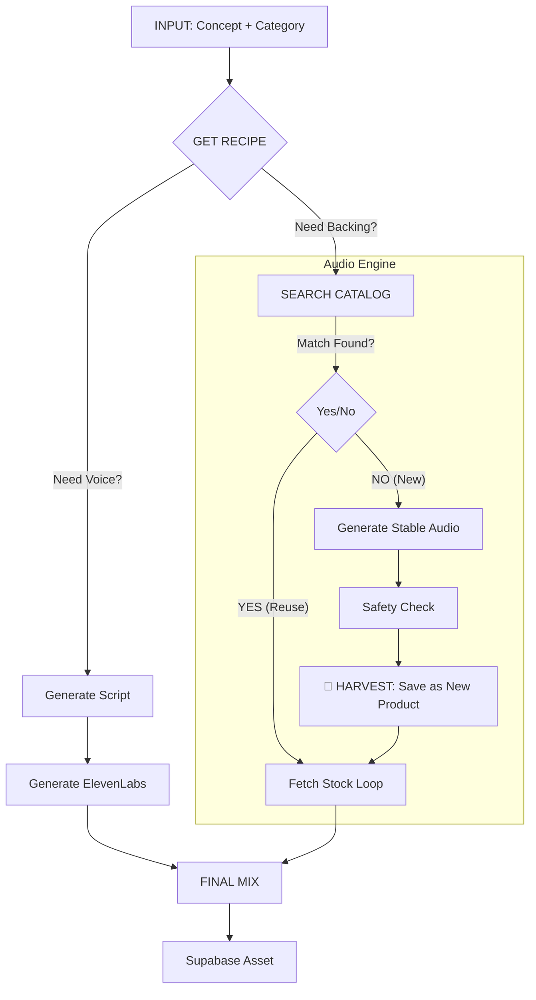

# 🏭 FACTORY V3: THE RECIPE & HARVEST ENGINE
*Codebase-defined standards. Smart Reuse + Automatic Catalog Growth.*

## 1. THE ARCHITECTURE (VISUAL FLOW) 🗺️
The system is designed as a **Self-Growing Engine**.

---

## 2. THE COMPONENT MATRIX (The 10 Recipes) 🧩
*Every output is a stack of 1-2 layers.*

| Category ID | 🗣️ Layer A: VOICE | 🎧 Layer B: BACKING TYPE | Example Recipe |
| :--- | :--- | :--- | :--- |
| `sleep` | **YES** (Storyteller) | **Soundscape** | Story + Rain |
| `meditation` | **YES** (Guide) | **Frequency** | Breath Guide + 432Hz |
| `fantasy` | **YES** (Narrator) | **Music** (Cinematic) | Journey + Fantasy Score |
| `kids` | **YES** (Character) | **Music** (Lullaby) | Tale + Soft Melody |
| `motivation` | **YES** (Coach) | **Music** (Epic/Upbeat) | Speech + Drums |
| `work_break` | **YES** (Coach) | **Soundscape** (Cafe/Office) | Reset + Cafe Noise |
| `nature` | **OPTIONAL** (Poet) | **Soundscape** (Pure) | (Voice) + Forest |
| `soundscape` | **NO** | **Soundscape** (Pure) | Rain Only |
| `music_instr`| **NO** | **Music** (Instrumental) | Piano Only |
| `binaural` | **NO** | **Frequency** (Pure) | 40Hz Only |

---

## 3. THE EXPANSION LOGIC (SEARCH OR CREATE) 🌾
*How the Factory decides whether to reuse a file or print a new one.*

### Step A: The Search (Claude) 🕵️
Claude analyzes the Concept ("A walk on Mars") and looks at the available `05_CATALOG_MASTER`.
*   **Query**: "Do we have a Soundscape like 'Mars Wind' or 'Space Rumble'?"
*   **Result**: 
    1.  **Match Found (>80%)**: Uses `sck_brown_noise_01`. (Cost: $0).
    2.  **No Match**: Flags "NEED NEW ASSET".

### Step B: The Creation (Harvest) 🏗️
If "NEED NEW ASSET" is true:
1.  **Generate**: Factory calls Stable Audio to create "Mars Wind".
2.  **Harmonize**: Checks against safety filters (no glitches).
3.  **HARVEST (CRITICAL)**:
    *   Saves file as `sck_mars_wind_01.mp3`.
    *   **Adds to Catalog**: Inserts record into Database as a standalone `soundscape` product.
    *   **Use**: Mixes it into the current Story ("Walk on Mars").

**Result**: Next time someone asks for "Space", we **Reuse** `sck_mars_wind_01`. The Catalog grows automatically.

---

## 4. EXAMPLE SCENARIOS

### Scenario A: Reuse (High Efficiency)
*   **Input**: `sleep` | "Rainy Cabin"
*   **Recipe**: Voice + Soundscape.
*   **Search**: Found `sck_rain_on_roof`.
*   **Action**: Generate Voice + Reuse Rain.

### Scenario B: Growth (New Asset)
*   **Input**: `fantasy` | "Underwater City"
*   **Recipe**: Voice + Music.
*   **Search**: No underwater music found.
*   **Action**: 
    1.  Generate `mus_underwater_ambience_01`.
    2.  **Save `mus_underwater_ambience_01` as new Product.**
    3.  Generate Voice.
    4.  Mix.

### Scenario A: "Bedtime Story for Kids"
*   **Input**: { Concept: "A brave bunny", Cat: `kids`, Dur: 5, Narrated: `true` }
*   **Director**:
    *   Writes generic brave bunny story.
    *   Selects Backing: `sck_forest_morn` (Birds/Happy) or `sck_night_forest` (Calm).
*   **Result**: High quality story, zero music cost, safe background.

### Scenario B: "Deep Work Focus"
*   **Input**: { Concept: "Coding flow", Cat: `work_break`, Dur: 20, Narrated: `false` }
*   **Director**:
    *   Script: `null` (Instrumental).
    *   Selects Backing: `sck_binaural_gamma` (Focus).
*   **Result**: A pristine 20-min looped track with a custom Cover Art "Cyberpunk desk".

## 5. WHY THIS WINS 🏆
1.  **Safety**: We never generate random AI music that might glitch.
2.  **Cost**: Music generation drops to $0.
3.  **Coherence**: The "Mood" of the story matches the "Loop" because Claude made the cinematic choice.
